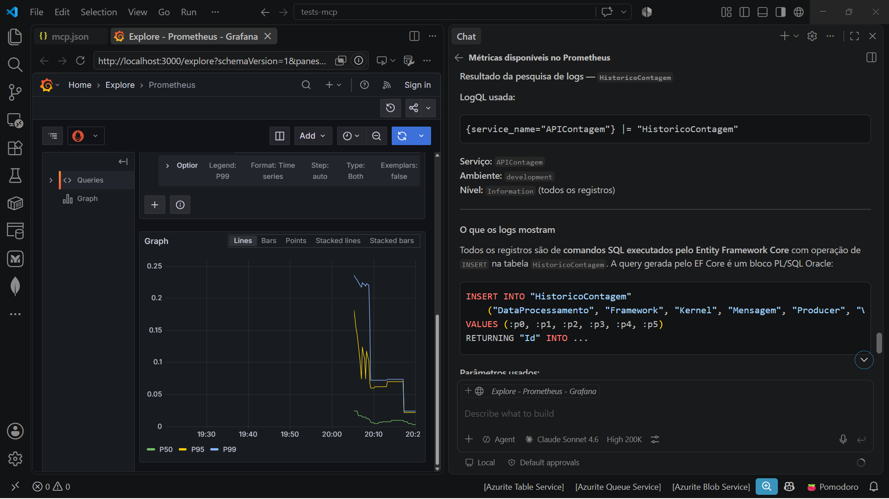

# grafana-mcpserver-uvx-vscode-githubcopilot
Configurações para uso do MCP Server do Grafana com uvx (packages Pythons) + Visual Studio Code + GitHub Copilot.

Mais informações sobre este MCP Server em: **https://grafana.com/docs/grafana/latest/developer-resources/mcp/introduction/**

Arquivo **mcp.json**:

```json
{
	"servers": {
		"grafana": {
			"command": "uvx",
			"args": ["mcp-grafana"],
			"env": {
				"GRAFANA_URL": "http://localhost:3000"
			}
		}
	},
	"inputs": []
}
```

Alguns testes com este MCP Server consultando métricas do Prometheus e logs no Grafana Loki:


